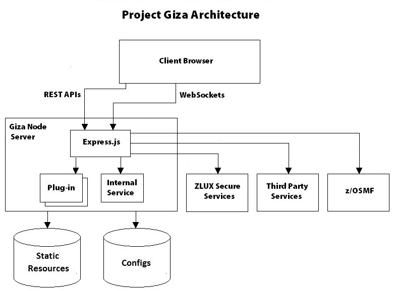

# Technical overview

The following diagram and the explanations exemplify how Project Giza works.

For overview information about Brightside Command Line Interface (CLI), see [Overview of Brightside CLI](cli-releasenotes.md)

**Parent topic:** [Introducing Project Giza](../topics/introduction.md)
